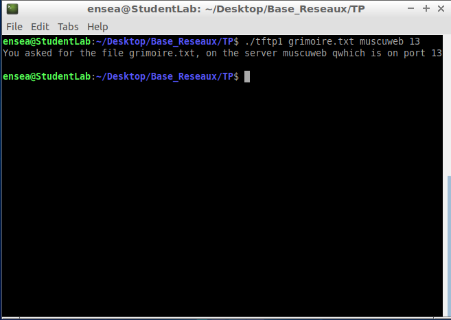

# Base_Reseaux

## Question 1 :

```ruby

#include <stdio.h>
#include <stdlib.h>

int main(int argc, char *argv[]) {

    if (argc != 4) {		/* We check if the number of arguments is correct */
        fprintf(stderr, "Usage: %s <file> <server_name> <port>\n", argv[0]);
        exit(EXIT_FAILURE);
    }
    
    
    char *file = argv[1];
    char *server_name = argv[2];
    char *port = argv[3];		/* Here we've created 3 pointer to get the arguments entered during the program's execution */


    printf("You have requested the file %s, on the server %s, which is on port %s\n", file, server_name, port);

    return 0;
}

```



## Question 2 :

```ruby

#include <stdio.h>
#include <stdlib.h>
#include <sys/types.h>
#include <sys/socket.h>
#include <netdb.h>
#include <string.h>
#include <arpa/inet.h>

int main(int argc, char *argv[]) {
    
    if (argc != 4) {
        fprintf(stderr, "Usage: %s <file> <server_name> <port> \n", argv[0]);
        exit(EXIT_FAILURE);
    }
    
    
    char *file = argv[1];
    char *server_name = argv[2];
    char *port = argv[3];


    printf("You asked for the file %s, on the server %s qwhich is on port %s \n", file, server_name, port);
    
    struct addrinfo hints;
    struct addrinfo *res;
    
    memset(&hints, 0, sizeof( struct addrinfo));	/* Initialize hints to zero and set desired socket options */
    hints.ai_socktype = SOCK_DGRAM;			/* Datagram socket (UDP) */
    hints.ai_family = AF_INET;				/* Use IPv4 */
    hints.ai_protocol = 0;				/* Use UDP protocol */
    
    int adress = getaddrinfo(server_name, port, &hints, &res);
    
    if (adress == -1){
		perror("getaddrinfo");
		return(EXIT_FAILURE);
	}
	
    printf("The server adress is  %d \n",adress);
    
    return 0;
}

```

## Question 3 :

```ruby

#include <stdio.h>
#include <stdlib.h>
#include <sys/types.h>
#include <sys/socket.h>
#include <netdb.h>
#include <string.h>
#include <arpa/inet.h>

int main(int argc, char *argv[]) {
    
    if (argc != 4) {
        fprintf(stderr, "Usage: %s <file> <server_name> <port>\n", argv[0]);
        exit(EXIT_FAILURE);
    }
    
    char *file = argv[1];
    char *server_name = argv[2];
    char *port = argv[3];


    printf("You asked for the file %s, on the server %s which is on port %s\n", file, server_name, port);
    
    struct addrinfo hints;
    struct addrinfo *res;	/* Pointer to the result of getaddrinfo */
    
    memset(&hints, 0, sizeof( struct addrinfo));
    hints.ai_socktype = SOCK_DGRAM;
    hints.ai_family = AF_INET;
    hints.ai_protocol = IPPROTO_UDP;
    int adress = getaddrinfo(server_name, port, &hints, &res);			/* Obtain address information for the given server name and port */
    int sock = socket(res->ai_family, res->ai_socktype, res->ai_protocol);	/* Create a socket using the obtained address information */
    
    
    
    if(adress == -1){
		perror("getaddrinfo error");
		exit(EXIT_FAILURE);
	}

	if (sock <0){
		perror("socket error");
		exit(EXIT_FAILURE);
	}
    
    return 0;
}
```
## Question 4.a) :

```ruby
#include <stdio.h>
#include <stdlib.h>
#include <sys/types.h>
#include <sys/socket.h>
#include <netdb.h>
#include <string.h>
#include <arpa/inet.h>
#include <unistd.h>

#define BUFSIZE 128

int main(int argc, char *argv[]) {
    
    if (argc != 4) {
        fprintf(stderr, "Usage: %s <file> <server_name> <port>\n", argv[0]);
        exit(EXIT_FAILURE);
    }
    
    
    char *file = argv[1];
    char *server_name = argv[2];
    char *port = argv[3];


    printf("You asked for the file %s, on the server %s which is on port %s\n", file, server_name, port);
    
    struct addrinfo hints;
    struct addrinfo *res;
    
    memset(&hints, 0, sizeof( struct addrinfo));
    hints.ai_socktype = SOCK_DGRAM;
    hints.ai_family = AF_INET;
    hints.ai_protocol = IPPROTO_UDP;
    
    int adress;
    if((adress = getaddrinfo(server_name, port, &hints, &res)) == -1){
		perror("getaddrinfo error");
		exit(EXIT_FAILURE);
	}


    int sock;
    if ((sock = socket(res->ai_family, res->ai_socktype, res->ai_protocol))==-1){
		perror("socket error");
		exit(EXIT_FAILURE);
	}
	
	// RRQ's request
	char buffer[BUFSIZE];
	memset(buffer, 0, BUFSIZE);
	buffer[1] = 1;
	strcpy(buffer+2, argv[1]);
	size_t padding = strlen(buffer+2);
	strcpy(buffer+2+padding+1,"octet");
	size_t padding2 = strlen(buffer+3+padding);	/* We've created the complete serie of informations that we've to send to create a RRQ's request */
	
	if (sendto(sock, buffer, padding+padding2+4, 0, res->ai_addr, res->ai_addrlen) == -1){	/* We send the request to the server and test if the request has been send succesfully or not */
		perror("send RRQ");
		exit(EXIT_FAILURE);
	}
	return 0;
}
```
.png)


 
